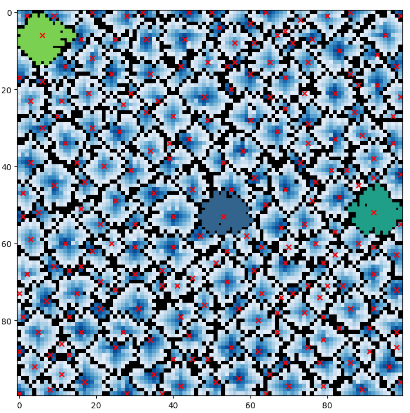

## [Day 9: Smoke Basin](https://adventofcode.com/2021/day/9)

### Solution
- **Part 1:** construct a `lte` matrix such that `lte[i,j] = count (neighbours <= mat[i,j])`
  - then, the low points are the smallest ones w.r.t. their neighbours, i.e. `lte == 0`.
- **Part 2:** for each low point, apply BFS to find the basins, then sort them by size.
```
Part 1: 494
Part 2: 1048128
```

### Usage
```
$ make
```

### Visualization
```
$ make visualize
```
- Red crosses represent the low points.
- Filled regions = top 3 largest basins.
- Black squares = cells with `value == 9`.


