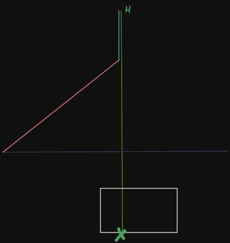

## [Day 17: Trick Shot](https://adventofcode.com/2021/day/17)

### Solution
First, we'll make the assumption that the target area is below and to the right of the starting position:
```python
assert yl < yh < 0
assert 0 < xl < xh
```
Let `a = dx`, `b = dy` for simplicity, `H` = max height, `T` = steps needed to reach `H`,
`tri(n) = n * (n+1) / 2`.

The motion will be like this:




#### Movement on `x`

- After some steps (red segment), `x` becomes constant `tri(a)` (`dx = 0`).
- Movement now happens only on `y`.
- Thus, if there is an `X in [xl, xh]` such that `X = tri(a)`, with `a, X int`, then we're guaranteed to hit the target.

#### Movement on `y`
```
b(t) = b0 - t
b(T) = 0 => T = b0 (initial dy)

y(t) = sum_i b(i) = b0 t - tri(t-1)
H = y(T=b0) = tri(b0)
```

We want to maximize `H` while still reaching target area.
This means that when we are back at `y = 0` we have to go directly to `y = yl` (i.e. in one step).
This gives the maximum initial `dy`.
Going from 0 to `yl` in more than 1 step will lead to a lower `dy`, thus a lower `H`.

To summarize:
```
t:  0 ... T, T+1 ...   2T,  2T+1, 2T+2
b: b0 ... 0, -1  ...  -b0, -b0-1, //
y:  0 ... H, H   ...   b0,     0, yl
```

Finally:
```
-b0 - 1 = yl => b0 = -yl - 1
H  = tri(b0)
```

```
Part 1: 5050
Part 2: 2223
```

### Usage
```
$ make
```
