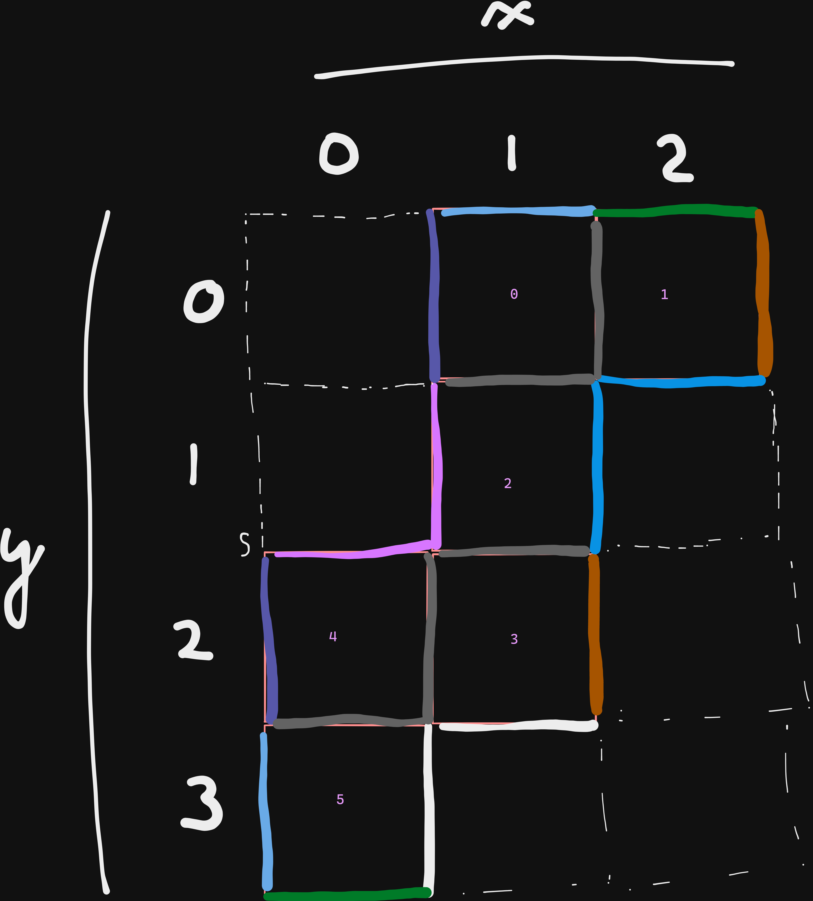

### Solution
```
Part 1: 77318
Part 2: 126017
```

Complex coordinates, but y-axis is flipped (down is positive), so rotations are mirrored,
i.e. `RDLU = [1, 1j, -1, -1j]`.

Part 1 is about 2D wrapping: when falling off the board, "go back" until arriving on the other side.
If there's a `#`, then discard the move (i.e. don't wrap).

Part 2 is about 3D wrapping (see cube below).
I [initially tried](./_solve.py) to simulate an ant walking in the cube, but felt a bit cumbersome,
so [instead](./solve.py) I am following a
[neat idea](https://www.reddit.com/r/adventofcode/comments/zsct8w/comment/j17k7nn)
to essentially enclose the cube in a `4 x 3 grid`, where each square is `50x50`.
Then, I hardcoded all 14 possible wrapping cases.

</img>

### Usage
```
$ make
```
