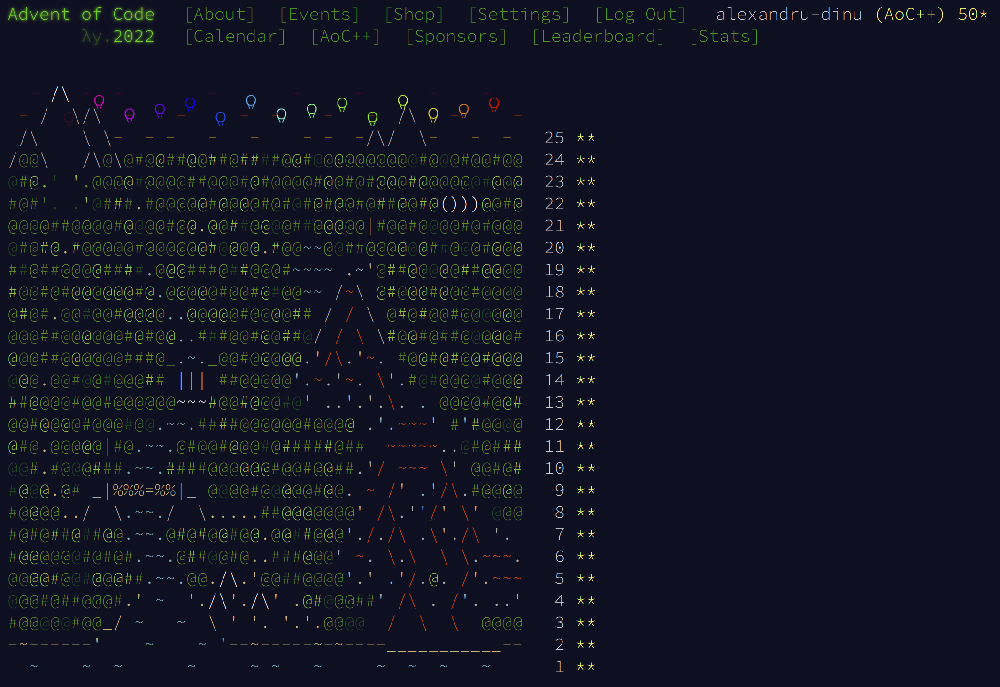
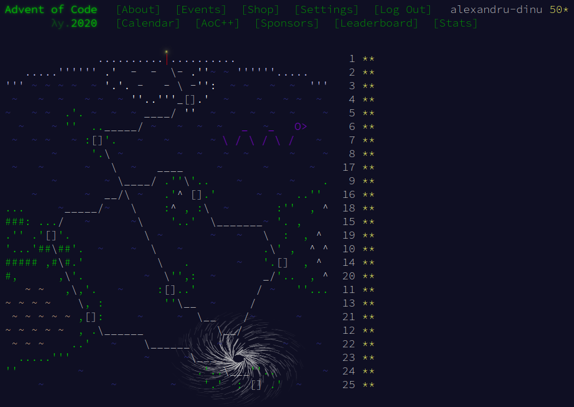

<h1 align="center">Advent of Code</h1>

<!-- MDUP:BEG (RUN:./.scripts/gen_badges.py --link-to-dir) -->
<a href="./2022"></img></a>
<a href="./2021"></img></a>
<a href="./2020"></img></a>
<a href="./2019"></img></a>
<a href="./2018"></img></a>
<a href="./2017"></img></a>
<a href="./2016"></img></a>
<a href="./2015"></img></a>
<!-- MDUP:END -->

<a href="https://github.com/alexandru-dinu/advent-of-code/actions/workflows/tests.yml">
    
    </img>
</a>

<table border="0">
    <tr>
        <td></img></td>
        <td></img></td>
    </tr>
</table>
